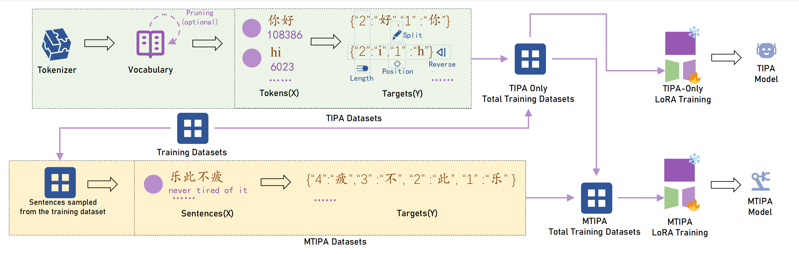

# TIPA
# Enhancing Character-Level Understanding in LLMs through Token Internal Structure Learning


# 📄 Our Paper Has Been Accepted by ACL 2025! 🎉

**All code and datasets will be reorganized and open sourced. Looking forward to it! Thank you for your attention to this work!**

**🎉 Exciting News!**  
We are thrilled to announce that our paper has been accepted as a **long paper** at the **ACL 2025 Main Conference**! 🌟

### 📌 Key Details:
- **Conference**: [ACL 2025](https://acl2025.org/) (Annual Meeting of the Association for Computational Linguistics)  
- **Track**: Main Conference (Long Paper)  
- **Category**: 🏆 Top-tier NLP conference  

### 🙏 Acknowledgments:  
A huge thanks to all co-authors, reviewers, and the ACL community for their valuable feedback! 🤝  

Stay tuned for the camera-ready version! 📢  

## **TIPA Usage Documentation**

---

### **Overview**

This documentation describes the usage of the **`tipa.py`** script. The script processes a HuggingFace tokenizer's vocabulary, generates TIPA (Token Internal Position Awareness) mappings for each token, and outputs the results in a JSONL file. Each record in the JSONL file contains:

- **token_id**: The ID of the token in the tokenizer's vocabulary.
- **token**: The string representation of the token.
- **tipa_forward**: Forward character position mapping (left-to-right).
- **tipa_reverse**: Reverse character position mapping (right-to-left).

---

### **Dependencies**

Before running the script, ensure the required libraries are installed:

```bash
pip install numpy transformers
```

---

### **How to Use**

1. **Place `tipa.py` in Your Working Directory**.

2. **Run the Script**.

   Run the following command in your terminal:

   ```bash
   python tipa.py
   ```

3. **Output File**.

   The script generates a **JSONL file** named `tipa_tokens.jsonl` (default name) in the working directory.

   - Each line in the file contains a JSON object with TIPA mappings for a single valid token.

4. **Customize the Parameters**.

   You can customize the HuggingFace tokenizer and output file name by editing the script:

   ```python
   tokenizer_name = "Qwen/Qwen2.5-7B-Instruct"
   output_filename = "all_tipa/qwen2.5_tipa_tokens.jsonl"
   ```

---

### **Example JSONL Output**

Each line in the `tipa_tokens.jsonl` file represents a token's TIPA information in JSON format. Example:

```json
{"token_id": 123, "token": "你好", "tipa_forward": {"1": "你", "2": "好"}, "tipa_reverse": {"2": "好", "1": "你"}}
{"token_id": 124, "token": "世界", "tipa_forward": {"1": "世", "2": "界"}, "tipa_reverse": {"2": "界", "1": "世"}}
{"token_id": 125, "token": "Hi", "tipa_forward": {"1": "H", "2": "i"}, "tipa_reverse": {"2": "i", "1": "H"}}
```

---

### **Code Description**

1. **TIPA Function**  
   Generates character position mappings for strings in forward and reverse order.

   - **Forward**: Positions start from the beginning of the string.
   - **Reverse**: Positions start from the end of the string.

2. **Valid Token Extraction**  
   - Loads the tokenizer vocabulary.
   - Filters out invalid UTF-8 tokens.

3. **JSONL Output**  
   Saves each token's ID, string, and TIPA mappings into a JSONL file line-by-line.

---

### **Advanced Usage**

To use a different tokenizer model, change the tokenizer name:

```python
tokenizer_name = "bert-base-uncased"
```

To change the output file name:

```python
output_filename = "custom_output.jsonl"
```

Run the script again to process the new configuration.

---

### **File Loading Example**

To load the generated JSONL file and process the records in Python:

```python
import json

with open("all_tipa/qwen2.5_tipa_tokens.jsonl", "r", encoding="utf-8") as f:
   for line in f:
      record = json.loads(line)
      print(record)
```

---

### **Use Cases**

1. **Token Analysis**: Analyze character-level structure of tokens for NLP tasks.
2. **Preprocessing**: Use TIPA mappings to enhance token-level models.
3. **Dataset Preparation**: Generate structured token information for downstream tasks.

---

### **Advanced Usage: Language-Specific Optimization**

If your domain is limited to a specific language, such as **Chinese**, and your dataset has extensive coverage (sufficient to include all tokens of the target language), you can **prune the tokenizer's vocabulary** using a `set` of tokens obtained from your dataset. 

By filtering the vocabulary through the tokens appearing in your dataset, you can create a **pruned TIPA dataset**. Training the model on this pruned TIPA data can significantly **accelerate the training process** without compromising performance.

**Steps for Optimization**:
1. Extract all tokens from your dataset through segmentation (e.g., Chinese word segmentation).
2. Use a `set` data structure to remove duplicate tokens.
3. Filter the tokenizer's vocabulary to include only the tokens in the pruned set.
4. Generate the TIPA mappings (forward and reverse) only for the pruned tokens.
5. Train the model using the resulting TIPA data.

This approach reduces the size of the TIPA dataset while ensuring it remains comprehensive for the specific language, resulting in faster and more efficient model training.

---

This method is especially effective for large datasets in Chinese or similar languages where the token space is finite and well-defined. 🚀

### **Conclusion**

The `tipa.py` script is a powerful tool for analyzing and processing tokenizer vocabularies. It generates detailed TIPA mappings and stores them efficiently in a JSONL format for further use.

For any additional questions or support, refer to the HuggingFace documentation for tokenizers. 🚀

Email: s231231076@stu.cqupt.edu.cn

Huggingface Models:
[**MTIPA-E1**](https://huggingface.co/LLMMINE/MTIPA-7B-PositionTask) | [**TIPA-E2**](https://huggingface.co/LLMMINE/TIPA-7B-TranditionalTask)

[\[**Paper**\]](https://arxiv.org/abs/2411.17679)

Cite: 
```
@misc{xu2024enhancing,
    title={Enhancing Character-Level Understanding in LLMs through Token Internal Structure Learning},
    author={Zhu Xu and Zhiqiang Zhao and Zihan Zhang and Yuchi Liu and Quanwei Shen and Fei Liu and Yu Kuang and Jian He and Conglin Liu},
    year={2024},
    eprint={2411.17679},
    archivePrefix={arXiv},
    primaryClass={cs.CL}
}
```
